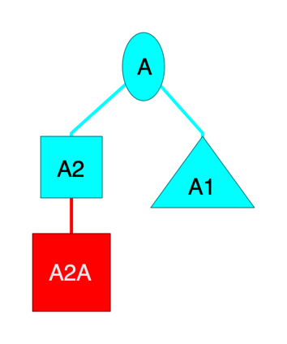

# filterCSV

iThoughts is a third-party application for creating and managing mind maps. It runs on iOS, iPad OS, Mac OS and Windows.

You can create a mind map either in the application itself or by importing files in a number of other formats. The most complete format is Comma-Separated Value (CSV). Being a text format, CSV can be programmatically created in a number of programming languages, such as Python.

The CSV format that iThoughts understands has a tree-like structure. A tree consists of nodes, which contain data as well as potentially child nodes. A node with no parent is called a root node. A node with no children is called a leaf node.

There can be multiple root nodes - and hence multiple trees - in an iThoughts CSV file. In which case it's better to call the ensemble a forest of trees.

As well as the nodes' tree structure, an iThoughts' CSV file can store for each node its colour, its position, its shape and other attributes.
To a very limited extent the format is documented [here](https://www.toketaware.com/ithoughts-howto-csv). A better way to understand the format is to export a mind map from iThoughts as CSV and look at the resulting file.

* [An Introduction To The iThoughts CSV File Format](#anintroductiontotheithoughtscsvfileformat)
* [About filterCSV](#aboutfiltercsv)
* [Using filterCSV](#usingfiltercsv)
    * [Specifiers](#specifiers)
    * [Actions](#actions)
        * [Colour Numbers](#colournumbers)
        * [Colour RGB Values](#colourrgbvalues)
        * [Delete](#delete)
        * [Keep](#keep)
        * [Shapes](#shapes)
        * [Positions](#positions)
        * [Icons](#icons)
        * [Priority](#priority)
        * [Progress](#progress)
        * [Removing Notes, Shapes, Colours, Positions, Icons, Progress, And Priority](#removingnotesshapescolourspositionsiconsprogressandpriority)
        * [Eliminating A Level](#eliminatingalevel)
        * [Computing Statistics About A Mind Map](#computingstatisticsaboutamindmap)
        * [Merging Nodes Into Their Parent Node](#mergingnodesintotheirparentnode)
        * [Sorting Child Nodes](#sortingchildnodes)
        * [Reversing The Order Of Child Nodes](#reversingtheorderofchildnodes)
        * [Spreading Out Level 0 (Root) Nodes](#spreadingoutlevel0rootnodes)
    * [Input Files](#inputfiles)
        * [Nesting Level Detection](#nestingleveldetection)
        * [Metadata](#metadata)
        * [Checking](#checking)
        * [Handling CSV Files Not In The Format iThoughts Expects](#handlingcsvfilesnotintheformatithoughtsexpects)
    * [Output Formats](#outputformats)
        * [Markdown Output](#markdownoutput)
        * [HTML Output](#htmloutput)
        * [Freemind And OPML XML Output](#freemindandopmlxmloutput)
        * [GraphViz .dot Format](#graphviz.dotformat)
        * [Indented Text](#indentedtext)
    * [iThoughts CSV File Format](#ithoughtscsvfileformat)
    * [Command Files](#commandfiles)
    * [Test Files](#testfiles)
    * [iThoughts Shape Names](#ithoughtsshapenames)
    * [iThoughts Icon Names](#ithoughtsiconnames)

## An Introduction To The iThoughts CSV File Format

Here is a sample CSV file in the format required by iThoughts:

    "colour","shape","level","level0","level1","level2"
    00FFFF,,0,"A"
    ,triangle,1,,A1
    ,square,1,,A2
    FF0000,square,2,,,A2A

and here is how it looks when imported into iThoughts:



This is obviously a very simple example, but it illustrates some features of the file format:

* Each line is a node, apart from the first one.
* All lines have a cell in the "level" column, with the level number filled in.
* Some nodes have colours, in RGB format. (Nodes "A2" and "A1" inherit the turquoise colour from node "A".)
* Some nodes have shapes associated with them.

A more detailed description of the file format is given in [iThoughts CSV File Format](#ithoughtscsvfileformat) but this brief description should be enough to get you started.

In more complex cases other columns come into play.

## About filterCSV

filterCSV is a set of tools to automatically edit a CSV file in the form used in iThoughts. filterCSV is written in Python 3.6+. It has been tested on a Raspberry Pi and a machine running macOS.

Based on matching regular expressions, plus a few other criteria, you can do things for matching nodes such as:

* Set colours for nodes
* Change their shape
* Delete them
* Set their positions
* Set icons for nodes

You can check the structure of the input CSV file is good for importing into iThoughts.

You can export the CSV file as a Markdown file consisting of headings and bulleted lists, and in a number of other formats.

**NOTE:** In this document we will use terms such as "mind map" and "tree". Structurally the data represents a tree. \
It might or might not be used for mapping your mind.

## Using filterCSV

filterCSV reads from stdin and writes to stdout, with messages (including error messages) written to stderr. For example:

    filterCSV '^A1$' 'triangle' < input.csv > output.csv

It's designed for use in a pipeline, where the input of one program can be the output of another.

Do not specify the input and output files as command parameters. Instead

* Code the input file as an input stream using `<`.
* Code the output file as an output stream using `>`.
* You can code stderr as an output stream using `2>` or let it default to the terminal session.

Command line parameters instruct filterCSV on how to process the parsed input file to create the output file. The parameters are specified in pairs.
Each pair consists of:

1. A specifier. This is a regular expression to match. (A special value `all` matches any value.)
1. An action or sequence of actions. 

In the case where no action is expected you can code anything you like for the second parameter. A useful suggestion would be to code `.` for it.

Instead of using command line parameters you can code the commands in a file read in from Stream 3. See [Command Files](#commandfiles) for more information on this, potentially more flexible, way of controlling filterCSV.

You can get some basic help by invoking filterCSV with no parameters. That help points to this README and the project on GitHub.

### Specifiers

Specifiers are used to specify which nodes to operate on and can be in one of the following forms.

* Regular expressions in a format the Python `re` module understands.
* A special value of `all`, matching all nodes.
* A special value of `none`, matching no nodes.
* A level specifier of the form `@level:n` - where `n` is an integer, referring to the level number.
* A priority specifier of the form `@priority:n` - where `n` is an integer between 1 and 5. You can use `@prio:n` for short. You can use `@nopriority` or `@noprio` to match nodes where the priority has not been set.
* A progress specifier of the form ``@progress:n` - where `n` is an integer between 0 and 100, representing percent complete. You can use `@prog:n` for short. You can use `@noprogress` or `@noprog` to match nodes where the progress has not been set.

**Notes:**

If you want to match a cell's text exactly you can code something like `^A1$` where `^` means 'the start of the text' and `$` means 'the end of the text'.

In the `level:n` form of the specifier the level of a node is taken from how it was read in - though that could be modified by `check repairsubtree`. \
If you're not sure the levels are properly numbered you should run `check repairsubtree` first. For example

For both `@priority:n` and `@progress:n` an empty value in the node's attribute means it's not been set.

```
filterCSV < input_file.csv > output_file.csv \
    check repairsubtree \
    @level:1 'triangle note'
```

### Actions

Actions you can take include:

* Specify a colour number
* Specify a colour RGB value
* `delete`
* `keep`
* Specify a shape
* Specify a position
* Specify an icon
* Removing colour, shape, and icon specifications
* Promote all subtrees at a certain level by 1 level
* Computing basic statistics about the mind map

In the following action specifications are case-insensitive; If you specify, for example, an action in upper case it will be converted to lower case before being applied to matching nodes.

You can, in most cases, specify a sequence of actions. You can separate them by spaces or commas. If you specify multiple actions you probably need to surround them with a pair of single quotes.

#### Colour Numbers

A colour number is a 1- or 2-digit number. It is specified relative to the top left of iThoughts' colour palette. (`1` is the first colour in the palette.)

You can also specify `nextcolour`, `nextcolor` or even `nc` and filterCSV will select the next colour in iThoughts' colour palette. `samecolour`, `samecolor` or `sc` can be used to specify the same colour again.

#### Colour RGB Values

This is a hexadecimal 6-character representation of the colour, in Red-Green-Blue (RGB) format. For example `FFAAFF`.

#### Delete

`delete` deletes the matching node and all its children.

####  Keep

`keep` retains the matching node, all of its children, and its parent, grandparent, great-grandparent, etc. The idea is to retain a workable tree.

For example

    filterCSV 'EXCPs' keep < input.csv > output.csv

would retain any nodes which match the string "EXCPs", and all the nodes below them. In addition, to ensure the tree remained valid (for import into iThoughts) any nodes leading from the root (level 0) to the matching nodes would be retained.

**Note:** You can use regular expression alternation to keep multiple subtrees. For example:

    filterCSV 'A1|X' keep < input.csv > output.csv

where `|` means either the term to the left (`A1`) or the term to the right (`X`) can be used to match.

If you use `keep` in a filterCSV action you can't use anything else. For example, you can't use `triangle`. You can use another specifier, perhaps `all`with `triangle` to get the same effect.

#### Shapes

You can specify a shape for matching nodes using one of the names in the list in [iThoughts Shape Names](#ithoughtsshapenames).


For example:

    filterCSV '^CF' triangle < input.csv > output.csv

would change the shape of any nodes which match the string "CF" (but having no characters preceding "CF") to a triangle.

You can also specify `nextshape`, or `ns` and filterCSV will select the next shape in iThoughts' set of shapes. `sameshape` or `ss` can be used to specify the same shape again.

#### Positions

Positions are specified in the form `{x,y}` where the braces are necessary.

At present setting the position only seems to work for Level 0 (root) nodes. You can have as many Level 0 nodes as you like.

For example:

    filterCSV 'A Root Node' '{100,200}' < input.csv > output.csv

would move a level 0 whose name including the string 'A Root Node' to position (100,200).

####  Icons

You can add an icon to matching nodes using one of the names in the list in [iThoughts Icon Names](#ithoughtsiconnames).

For example:

    filterCSV 'Done' tick < input.csv > output.csv

would add a tick icon to any nodes which match the string "Done".

**Note:** A node can have more than one icon so specifying `tick` in the above example would not replace any other icon; It would add a tick icon to any existing ones.

#### Priority

You can set a node's priority with `priority:n` or `prio:n`. You can unset it with `nopriority` or `noprio`.

For example:

    filterCSV 'Unimportant' prio:5 < input.csv > output.csv

will set the priority for any node matching "Unimportant" to 5.

####  Progress

You can set a node's progress with `progress:n` or `prog:n`. You can unset it with `noprogress` or `noprog`.

For example:

    filterCSV 'Got nowhere' prog:0 < input.csv > output.csv

will set the progress for any node matching "Got nowhere" to 0%.

#### Removing Notes, Shapes, Colours, Positions, Icons, Progress, And Priority

If you specify `noshape`, `nocolour`, `nonote`, `noposition`, or `noicons` the corresponding attribute is removed from matching nodes.

Similarly priority or progress can be unset with `nopriority`, `noprio`, `noprogress` or `noprog`.

Most usefully you could specify this with a match condition of `all` to reset an entire column. For example, `nonote` could clear all the notes from a mind map - to prepare it for exporting from iThoughts.

#### Eliminating A Level

Suppose you have some nodes at level 1 and you want to make them all level 0, retaining their subtrees. With `promote` you can do this.

If you specify, for example

    filterCSV promote 2 < input.csv > output.csv

The nodes at level 1 are deleted and all their direct children move up to level 1. These children might be the root of subtrees. All nodes in the subtrees are also promoted by 1 level.

####  Computing Statistics About A Mind Map

If you specify `stats` it will write basic statistics to an output file in one of the following forms:

* Flat file - if you specify `stats text`
* HTML table - if you specify `stats html`
* Markdown table - if you specify `stats markdown`
* Comma-Separated Value (CSV) - if you specify `stats csv`

The statistics are (for each level):

* Number of nodes at that level
* Number of distinct text values at that level

Here is an example - produced by specifying `stats text`:

    Level Nodes Distinct Nodes
        0     2              1
        1     2              2
        2     1              1
        3     1              1

####  Merging Nodes Into Their Parent node

You can merge a matching node into its parent as a bullet.

To do this specify `asbullet`. For example

    filterCSV ^A1$ asbullet < input.csv > output.csv

will merge any bullet whose text or note is 'A1' with its parent. The text of the note will be merged in, with the two characters '* ' denoting it's a bulleted item.

#### Sorting Child Nodes

You can sort the child nodes of selected nodes. The sort will be alphabetical and ascending.

For example

    filterCSV ^A1$ sort < input.csv > output.csv

will sort all the children of the nodes whose text is "A1".

#### Reversing The Order Of Child Nodes

You can reverse the order of the child nodes of selected nodes.

For example

    filterCSV ^A1$ reverse < input.csv > output.csv

will reverse the order of the children of the nodes whose text is "A1".

You can use reverse after sort to make the sort effectively alphabetically descending.

#### Spreading Out Level 0 (Root) Nodes

If you import a CSV file into iThoughts without specifying positions in the file iThoughts will place all the Level 0 (root) nodes on top of each other. \
This is probably not what you want. \
filterCSV can spread out the Level 0 nodes - either horizontally or vertically.

For example, if you specify `vspread 500` filterCSV will set the positions of the Level 0 nodes 500 units apart - one above the other.

For example, if you specify  `hspread 1000` filterCSV will set the positions of the Level 0 nodes 500 units apart - spaced out horizontally.

In both cases the children will be arranged as normal, relative to the root nodes.

vspread and hspread set the values for these nodes in the "position" column in the CSV file.\
Their format is of the form "{1000,0}". \
(In this example "1000" is the horizontal offset and "0" is the vertical offset.) \
If you specify vspread or hspread they will overwrite all Level 0 nodes' positions.

### Input Files

Input files can be in one of six formats:

* A CSV file that is already in a format supported by iThoughts' Import function.
* A flat file where each line is a new node. Spaces and tabs can be used to indent the text. Here the level of indentation is used to control what level the line is added at.
* A Markdown nested list where each line is a new node. Spaces and tabs can be used to indent the text. Here the level of indentation is used to control what level the line is added at. Only an asterisk (`*`) followed by a space is supported as a list item marker.
* An OPML XML file - with or without `head` or `body` elements.
* An XML file, including one with namespaces (both default and named).
* A CSV file where the hierarchy is described by how many empty cells are to the left of the first cell with text in.

#### Nesting Level Detection

When parsing a Markdown or tab/space-indented non-CSV file the first line with leading white space (spaces and/or tabs) is used to detect the indentation scheme: Any white space on this line is used as a single indentation level marker. It is expected that all lines are indented in the same way.

For example, if the second line starts with two spaces this is taken to indicate that every line will have zero, two, four, etc spaces:

* Zero spaces denotes a level 0 node
* Two spaces denotes a level 1 node
* Four spaces denotes a level 2 node
* And so on

If the file is detected to contain Markdown, leading dashes and asterisks followed by a single space are removed. (These are bulleted list markers in Markdown.) For example:

    * A
        * A1

leads to the input file being interpreted as a level 0 node with text "A" and its child node with text "A1".

For an XML input file the nesting level is in the data stream; Elements' children are at a deeper nesting level. \
On import child nodes are created for the element's value (if it has one) and any attributes. \
These are colour coded and free-standing nodes marked "Element", "Value", and "Attribute" are added as a legend.

#### Metadata

When importing Markdown text it can contain metadata that isn't part of the structure of the data. \
Here is an example of such a file:

```
font-size: 14
creation-date: 2020-08-29
   
   * A
       * A1
       * A2
```
Metadata consists of key/value pairs, one per line, at the beginning of the file. After the last line of metadata is a blank line. \filterCSV performs two actions on encountering metadata:

* Metadata key/value pairs are extracted and printed under the heading "Metadata".
* The metadata, including the blank line, is removed and filterCSV processes the remainder of the file.

#### Checking

If the input data is not a CSV file filterCSV performs two checks on it:

* If the indentation of an individual line contains a number of whitespace characters that is not a multiple of the first indented line's leading whitespace diagnostic messages are produced. This line's indentation level is rounded down.
* If the indentation of an individual line contains a sequence that is not the first indented line's leading whitespace (perhaps repeated) diagnostic messages are produced.

These checks are intended to help debug an indentation problem.

If you specify `check` - in place of a regular specifier - filterCSV will check the level column of the data. It will detect bad levels in the following way: If the level of a node is greater than one more than the parent node it will consider this to be an error - which will be reported.

If a level error is detected one of three things can happen:

* If the action is specified as `repair` or `repairnode`, filterCSV will set the node's level to 1 more than its parent's.<br/><br/>
This is good for the case where you want all the gory details of badly leveled nodes.
* If the action is specified as `repairsubtree`, filterCSV will set the node's level to 1 more than its parent's and then adjust the subtree below it in a similar fashion.<br/><br/>
This is good for the case where you want the tree repaired with a minimum of fuss. But you still get informed when repairs were necessary.

* If the action is `stop`, filterCSV will terminate.

As an example, you might code

    filterCSV check repair < input.csv > output.csv

#### Handling CSV Files Not In The Format iThoughts Expects

You can import a CSV file and the tree structure is described by how many empty cells are to the left of the first cell with text in.

If there is more than one cell in the line with text in the last such cell is used to form a note for the node.

Here is an example.

    "A"
    ,"A1"
    ,"A2","This is a note"
    ,,"A2A"

In the above node "A" is at level 0, nodes "A1" and "A2" are at level 1 - and "A2" has a note ("This is a note"), and "A2A" is at level 2.

### Output Formats

While generally you would write a CSV file for importing into iThoughts, you can also export the data to:

* A Markdown file
* A HTML table
* A HTML nested list
* A Freemind mind map
* An OPML outline

#### Markdown Output

A CSV file can be exported to Markdown with each level rendered according to the following rules:

* The first few levels are rendered as headings. For example the first level (level 0) might be rendered as `#` to denote "heading level 1".
* Subsequent levels are rendered as nested bullets, with `*` as the indicator for a list item. Each level is indented by pairs of spaces.

You can specify Markdown output by invocations such as

    filterCSV markdown 3 < myfile.csv > myfile.md

or

    filterCSV markdown '2 3' < myfile.csv > myfile.md

In the first case three levels of heading are required, starting with heading level 1. (Heading level 1 is the default).

In the second case two levels of heading are required, starting with heading level 3.

#### HTML Output

You can export to HTML as either a nested list or a table. Colour is preserved on output, as are notes.

You can specify HTML table output by invocations such as

    filterCSV html table < myfile.csv > myfile.md

You can specify HTML nested list output by invocations such as

    filterCSV html list < myfile.csv > myfile.md

#### Freemind And OPML XML Output

filterCSV can output to Freemind XML format, including notes and colours:

    filterCSV xml freemind < myfile.csv > myfile.mm

filterCSV can output to OPML XML format, but support for notes and colours by other programs is mixed. For example Omnifocus will create a custom "Notes" column:

    filterCSV xml opml < myfile.csv > myfile.opml

#### GraphViz .dot Format

filterCSV can export in a format compatible with the GraphViz .dot language. It creates a digraph (directed graph). Here is a sample output file:

    digraph {
     rankdir=TB
      N1[label="A"]
      N2[label="A1"]
      N1 -> N2
      N3[label="A2"]
      N1 -> N3
      N4[label="A2A",fillcolor="#00ff00",shape="rectangle",style="rounded,filled"]
      N3 -> N4
      N5[label="A2A1",fillcolor="#00ff00",shape="rectangle",style="rounded,filled"]
      N4 -> N5
      N6[label="X",shape="square"]
    }

Here a number of nodes, whose names begin with "N", are defined. Additionally, directed links (arcs with arrows on them) are defined between them. \
filterCSV preserves colours and most shapes on export to .dot format.

Here is a sample invocation:

    filterCSV digraph vertical < test.csv > test.dot
    
You can use the dot command (part of GraphViz) to turn this into a PNG graphic:

    dot -Tpng test.dot > test.png
    
In the above example the parameter `vertical` was used to align the root nodes next to each other, with descendants down the page. \ If you specify any other value, for example 'horizontal' or '.' the alignment will be horizontal. (You can use `v` for short, for `vertical`.)

#### Indented Text

You can write out the data as a text file where indentation is used to denote levels in the tree hierarchy. \
Use the `indented` command to write out the text in this format. \
There are numerous options for how to indent the text:

* Code `original` to use the same indentation characters as on input. (This will only work if you read in an indented-text file; Otherwise the indentation will be an empty string.)

* Code `tab` to use the tab character to indent.

* Code `space:n` to use n spaces for each indentation level.

* Code `.` as a shorthand to indent using two spaces for each level.

* Code any other characters to use them for indentation.

Here are two examples of usage:

    filterCSV < input.csv > output.txt indented space:4

will write out a file where four space characters are used for each level of indentation.

    filterCSV < input.csv > output.txt indented "--"

will write out a file where two dashes are used for each level of indentation.

### iThoughts CSV File Format

The CSV format that iThoughts understands has a tree-like structure, within a table. As well as the tree of nodes, colour, position, node shape and other attributes of a node can be specified in the CSV file. To a very limited extent the format is documented [here](https://www.toketaware.com/ithoughts-howto-csv). A better way to understand the format is to export a mind map from iThoughts as CSV and look at the resulting file.

The first row of the table contains headings iThoughts uses to understand the layout of the following rows. Each subsequent row represents a node.

In summary, the iThoughts CSV file format has, at a minimum, the following columns:

* level
* level0

This would be for a mind map with only (isolated) top-level nodes. An example like this would be

    level,level0
    0,Text for this sole node

The iThoughts CSV format is tabular.
    
But usually you want more than one level of node:

    level,level0,level1,level2
    0,Top-level node
    1,,Next-level node
    2,,,Leaf node at level 2
    1,,Another intermediate-level node

Here the structure is more apparent:

* Each node has its level in the hierarchy (starting with 0) filled in in the "level" cell in the first row.
* Each node's text is in the correct cell for the level. For example, the level 2 node's text is in the same column as the "level2" cell in the first row.

filterCSV ensures the "level" and "level*n*" columns are present - to the extent needed by the tree. It also always adds the following columns, before the "level" column:

* priority
* progress
* icons
* position
* colour
* shape

These extra columns are filled in to allow filterCSV to do interesting things with the attributes they represent, such as

* Filtering on attributes - such as "Priority 1"
* Setting attributes - such as setting the shape to a triangle.

While iThoughts can tolerate CSV files where trailing empty cells are suppressed, filterCSV includes them.

## Command Files

Instead of specifying commands as pairs of parameters on the command line you can use Stream 3 to point to a file containing the commands.

For example:

    filterCSV < input.csv > output.csv 3< commands.txt

Here the `3< commands.txt` specifies the commands will be read in from the file commands.txt.

The format is very similar to the command line format for specifiers and actions. For example:

    '^A1$' 'triangle FF0000' // A1 nodes get the red triangle treatment

In the above any characters before the first space are treated as the specifier. They do not have to be in quotation marks.
Any characters after the first space are treated as the actions - up to just before the double slash.

**Note:** The specifier and the actions must be on the same line.

In the example above a comment was introduced by `//`. Any characters after this on the same line are treated as a comment and ignored. \
You can comment out a whole line with `//` - which might be useful for exploration purposes. Blank lines are also ignored. \
Comments aren't feasible with command line parameters - so using a command file like this might be preferred.

## Test Files

[tests/README.md](./tests/README.md) describes test files that you can study to become familiar with filterCSV.

## iThoughts Shape Names

The following shape names are defined by iThoughts.

    auto
    rectangle
    square
    rounded
    pill
    parallelogram
    diamond
    triangle
    oval
    circle
    underline
    none
    square bracket
    curved bracket

## iThoughts Icon Names

The following icon names are defined by iThoughts. You can use them in two places

* For matching nodes on - for example 'all nodes whose icon is "tick".'
* For adding as an icon to a node - for example 'add the "p0" icon to all nodes that match "^A1$".'

The names below are in the sequence they appear in the iThoughts icon palette.

    tick
    tickbox
    p0
    p1
    p2
    p3
    p4
    p5
    p6
    p7
    p8
    p9
    signal-flag-red
    signal-flag-yellow
    signal-flag-green
    icon-signal-flag-black
    icon-signal-flag-blue
    icon-signal-flag-orange
    icon-signal-flag-purple
    icon-signal-flag-white
    icon-signal-flag-checkered
    icon-hat-black
    icon-hat-blue
    icon-hat-green
    icon-hat-red
    icon-hat-white
    icon-hat-yellow
    icon-calendar1
    icon-calendar7
    icon-calendar12
    icon-calendar31
    icon-calendar52
    arrow-down-blue
    arrow-left-blue
    arrow-right-blue
    arrow-up-blue
    arrow-up-green
    arrow-down-red
    stop
    prep
    go
    smiley_happy
    icon-smiley-neutral
    smiley_sad
    icon-money
    currency-dollar
    currency-euro
    currency-pound
    currency-yen
    icon-currency-won
    icon-currency-yuan
    hand-yellow-card
    hand-red-card
    hand-stop
    hand-thumb-down
    hand-thumb-up
    question
    icon-questionmark
    icon-information
    icon-exclamationmark
    alert
    icon-add
    cross
    sign-forbidden
    sign-stop
    idea
    icon-camera
    auction-hammer
    bell
    bomb
    dynamite
    fire
    hourglass
    target
    view
    icon-airplane
    icon-alarmclock
    icon-bug
    icon-businessmen
    icon-car
    icon-clients
    icon-cup
    icon-data
    icon-desktop
    icon-earth
    icon-flash
    icon-gear
    icon-heart
    icon-key
    icon-lock-open
    icon-lock
    icon-mail
    icon-pin
    icon-printer
    icon-scales
    icon-star
    icom-telephone
    icon-pencil
    icon-alarm
    icon-book
    icon-certificate
    icon-cloud
    icon-compasses
    icon-dice
    icon-folder
    icon-document
    icon-male
    icon-female
    icon-newspaper
    icon-paperclip
    icon-presentation
    icon-signpost
    icon-step


